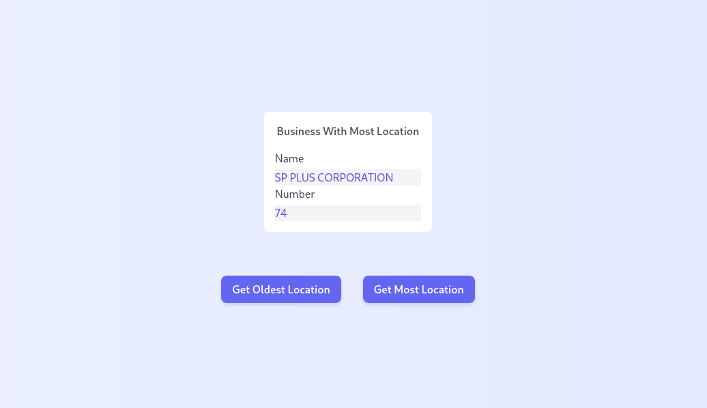

# AE Studio Challenge

## How to run

#### Frontend

Requirements:

- [Node [14.X]](https://nodejs.org/en/)

Go to frontend directory:

    cd frontend

Install requirements:

    npm install

Run the app in the development mode.

    npm start

Open [http://localhost:3000](http://localhost:3000) to view it in the browser.

Running tests:

    npm test

Launches the test runner in the interactive watch mode.

### `npm run build`

Builds the app for production to the `build` folder.\
It correctly bundles React in production mode and optimizes the build for the best performance.

The build is minified and the filenames include the hashes.\
Your app is ready to be deployed!

#### Backend

Go to backend directory:

    cd backend

Install requirements:

    pip install -r devrequirements.txt

Set enviorement variables:

    export DATA_LACITY_APP_TOKEN="rJB4D6X7r05yQMM356blksvgN"
    export LA_CITY_BUSINESSES_API = "https://data.lacity.org/resource/6rrh-rzua.json"

PS: On a real project the token should not be here, but i'll let in case you guys want to test

Run the app:

    python manage.py runserver

And the server should be running at http://127.0.0.1:8000/

Running tests:

    python manage.py test

## Code Style and Quality

This project uses pre-commit to ensure code style and quality. Git hook scripts are useful
for identifying simple issues before submission to code review. We run our hooks on every commit to automatically point
out issues in code such as missing semicolons, trailing whitespace, and debug statements. By pointing these issues out
before code review, this allows a code reviewer to focus on the architecture of a change while not wasting time with
trivial style nitpicks. Ref (https://pre-commit.com/)

#### Install

You can install using `pip`, but it will be installed on project requirements

    pip install pre-commit

Install git hooks used on this project

    $ pre-commit install

And you are good to go

### Hooks used

- black: code formatter for python
- end-of-file-fixer: makes sure files end in a newline
- trailing-whitespace: trims trailing whitespace.
- flake8: tool for style guide enforcement for python
- isort: to sort imports alphabetically, and automatically separated into sections for python
- prettier: code formatter for frontend

## Project Structure

- Frontend

  - Components: `frontend/components/`
  - Interfaces: `frontend/interfaces/`
  - Services: `frontend/services/`
  - Main Component: `frontend/App.tsx`

- Backend
  - Endpoints: `backend/active_businesses/views.py`
  - Service Layer: `backend/active_businesses/service.py`
  - Tests: `backend/active_businesses/tests.py`

## Screenshot

